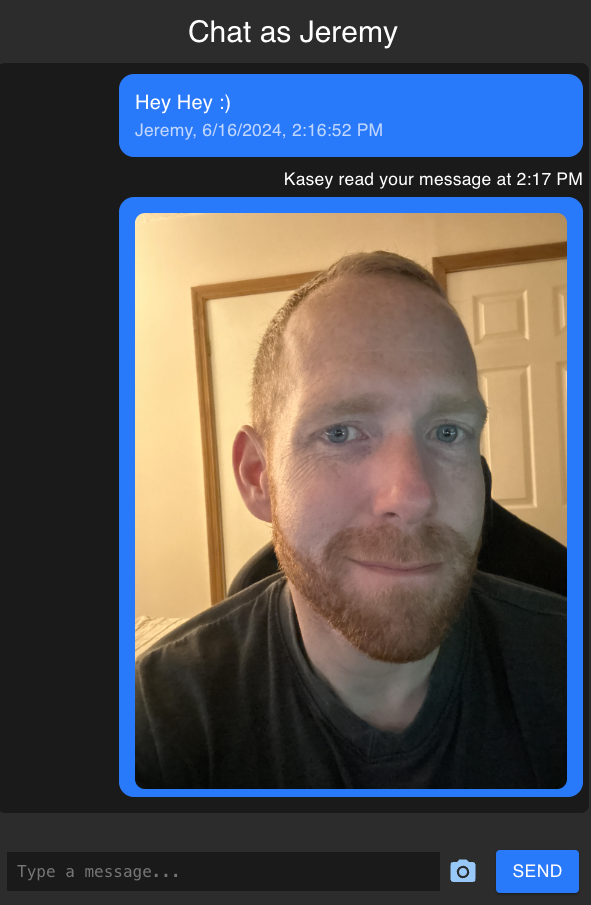

# React Chat Application

### This repository contains a real-time chat application built with React for the frontend, Node.js and Express for the backend, and Redis for message storage. It supports text and image messaging.



## Features

- Real-time messaging with typing indicators
- Image upload and display
- Message read receipts
- Responsive design for mobile and desktop

## Technologies Used

- **Frontend**: React, Material-UI
- **Backend**: Node.js, Express
- **Database**: Redis
- **File Storage**: MinIO/S3-compatible storage

## Prerequisites

- Docker and Docker Compose
- Node.js and npm/yarn
- A MinIO/S3-compatible storage setup

## Installation

1. Clone the repository:
   ```bash
   git clone git@github.com:JeremyDuncan/react-redis-chat-app.git
   cd react-chat-app
   ```

2. Create a `.env` file in the `backend` directory with the following content:
   ```env
   AWS_ACCESS_KEY_ID=your_aws_access_key_id
   AWS_SECRET_ACCESS_KEY=your_aws_secret_access_key
   AWS_REGION=your_aws_region
   S3_BUCKET_NAME=your_s3_bucket_name
   REDIS_URL=redis://redis:6379
   MINIO_ENDPOINT=https://s3.your-minio-endpoint.com
   MINIO_USE_SSL=true
   ```

3. Build and run the Docker containers:
   ```bash
   docker-compose up --build
   ```

## Usage

Once the application is running, you can access the chat application in your web browser at \`http://localhost:3000\`.

### Backend Endpoints

- **POST /messages**: Send a new message
- **GET /messages**: Retrieve all messages
- **PUT /messages/:id/read**: Mark a message as read
- **POST /typing**: Set typing status
- **GET /status/:user**: Get typing status and last read message

## Frontend

The frontend is a React application that provides the chat interface. It uses Material-UI for styling and axios for making HTTP requests to the backend.

### Main Components

- **Chat**: The main chat component that handles message display, sending, and receiving.
- **MessageList**: Displays a list of messages.
- **MessageInput**: Input field for typing and sending messages.
- **ImageUpload**: Allows users to upload and send images.

### Running the Frontend Locally

To run the frontend separately from Docker:

1. Navigate to the `frontend` directory:
   ```bash
   cd frontend
   ```

2. Install dependencies and start the development server:
   ```bash
   yarn install
   yarn start
   ```

3. The frontend will be available at \`http://localhost:3000\`.

## Backend

The backend is a Node.js application that uses Express to handle API requests. It connects to Redis for storing messages and uses MinIO for storing uploaded images.

### Running the Backend Locally

To run the backend separately from Docker:

1. Navigate to the `backend` directory:
   ```bash
   cd backend
   ```

2. Install dependencies and start the server:
   ```bash
   yarn install
   npx nodemon index.js
   ```

3. The backend will be available at \`http://localhost:5001\`.

## Docker Configuration

The \`docker-compose.yml\` file defines three services: \`redis\`, \`backend\`, and \`frontend\`.

### Redis

The Redis service stores messages and supports real-time messaging features.

### Backend

The backend service handles API requests and interacts with Redis and MinIO for storing messages and images, respectively.

### Frontend

The frontend service serves the React application.

## License

This project is licensed under the MIT License. See the [LICENSE](LICENSE) file for details.

## Contributing

Contributions are welcome! Please open an issue or submit a pull request.

## Acknowledgements

- [React](https://reactjs.org/)
- [Material-UI](https://mui.com/)
- [Node.js](https://nodejs.org/)
- [Redis](https://redis.io/)
- [MinIO](https://min.io/)
